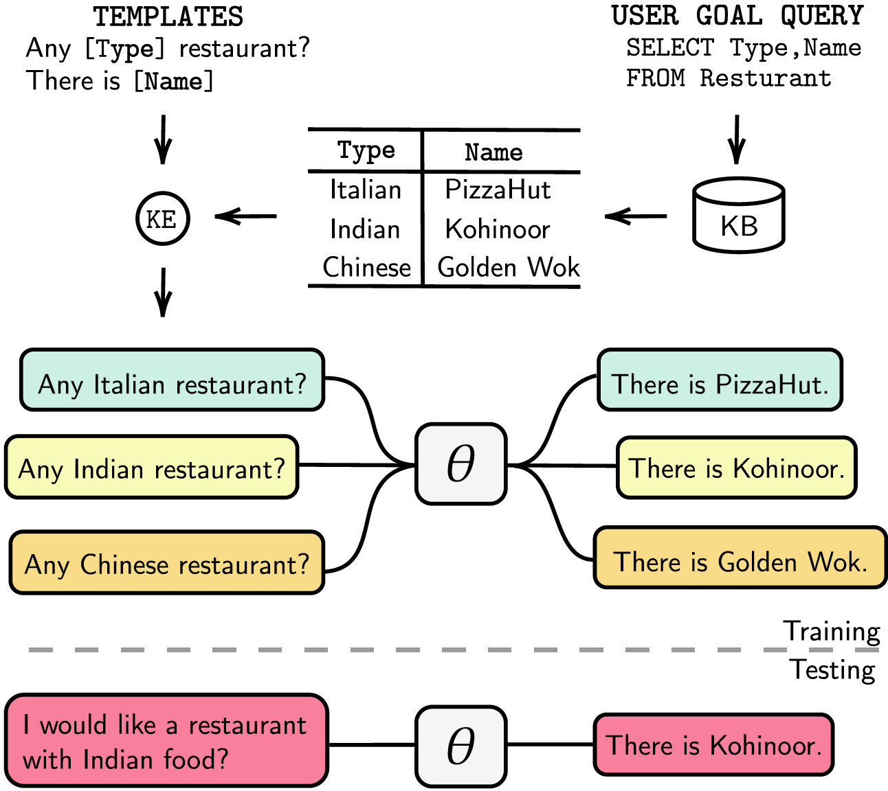

# Learning Knowledge Bases with Parameters for Task-Oriented Dialogue Systems
 [](https://opensource.org/licenses/MIT) 


This is the implementation of the paper:

**Learning Knowledge Bases with Parameters for Task-Oriented Dialogue Systems**. [**Andrea Madotto**](https://andreamad8.github.io), Samuel Cahyawijaya, Genta Indra Winata, Yan Xu, Zihan Liu, [Zhaojiang Lin](https://zlinao.github.io/), Pascale Fung **Findings of EMNLP 2020** [[PDF]](TBC)

If you use any source codes or datasets included in this toolkit in your work, please cite the following paper. The bibtex is listed below:
<pre>
TBC
</pre>

## Abstract
Task-oriented dialogue systems are either modularized with separate dialogue state tracking (DST) and management steps or end-to-end trainable. In either case, the knowledge base (KB) plays an essential role in fulfilling user requests. Modularized systems rely on DST to interact with the KB, which is expensive in terms of annotation and inference time. End-to-end systems use the KB directly as input, but they cannot scale when the KB is larger than a few hundred entries. In this paper, we propose a method to embed the KB, of any size, directly into the model parameters. The resulting model does not require any DST or template responses, nor the KB as input, and it can dynamically update its KB via finetuning. We evaluate our solution in five taskoriented dialogue datasets with small, medium, and large KB size. Our experiments show that end-to-end models can effectively embed knowledge bases in their parameters and achieve competitive performance in all evaluated datasets.

## Knowledge-embedded Dialogue:
<p align="center">

</p>
During training, the KE dialogues are generated by fulfilling the *TEMPLATE* with the *user goal query* results, and they are used to embed the KB into the model parameter theta. At testing time, the model does not use any external knowledge to generate the correct responses.

## Dependencies
We listed our dependencies on `requirements.txt`, you can install the dependencies by running
``` console
❱❱❱ pip install -r requirements.txt
```

In addition, our code also includes `fp16` support with `apex`. You can find the package from https://github.com/NVIDIA/apex.

## Experiments
### bAbI-5

### CamRest

### SMD 
***Dataset***

Download the preprocessed [**dataset**](https://drive.google.com/open?id=1p5FgDcXYPp3s0MzQSbAi-ixqRxNhtfXX) and put it under `./knowledge_embed/smd` folder.

```console
❱❱❱ unzip ./knowledge_embed/smd/SMD.zip
```

***Fine-tune GPT-2***

We provide the [**checkpoint**](https://drive.google.com/open?id=1CEtbwdosNqEGCB-zNntZ6a_UYCFx-SjI) of GPT-2 model fine-tuned on SMD training set. You can also choose to train the model by yourself using the following command.

```console
❱❱❱ python ./modeling/smd/main.py --task mt --no_sample --model_checkpoint $model_path
```

***Prepare Knowledge-embedded dialogues***

Firstly, we need to build databases for SQL query.

```console
❱❱❱ cd ./knowledge_embed/smd
❱❱❱ python generate_dialogues_SMD.py --build_db --split test
```

Then we generate dialogues based on pre-designed templates by domains. The following command enables you to generate dialogues in `weather` domain. Please replace `weather` with `navigate` or `schedule` in `dialogue_path` and `domain` arguments if you want to generate dialogues in the other two domains.

``` console
❱❱❱ python generate_dialogues_SMD.py --split test --dialogue_path ./templates/weather_template.txt --domain weather --num_augmented_dialogue 100 --output_folder ./data/test
```


### MWOZ

### OpenDialKG


## Further Details
For the details regarding to the experiments, hyperparameters, and Evaluation results you can find it in the main paper of and suplementary materials of our work.


